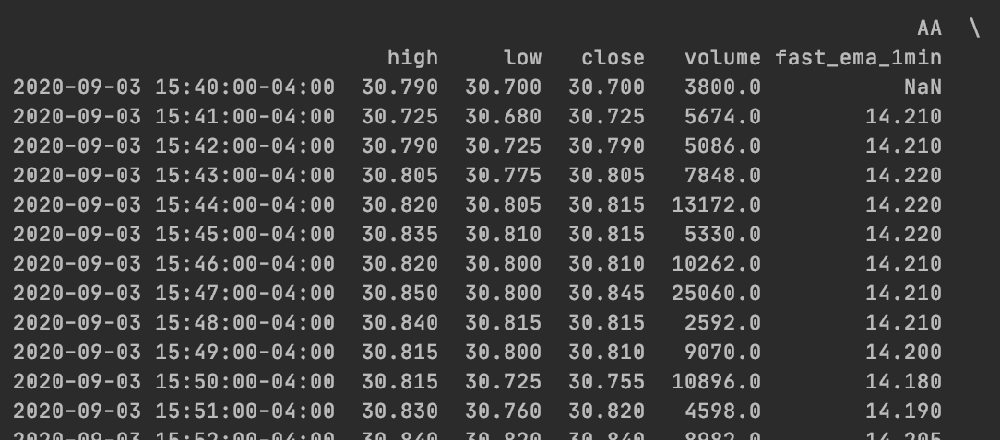
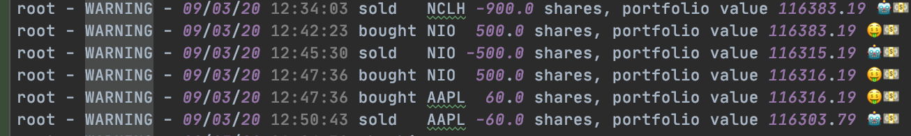

# ALPACA-TRADING-BOT
This a trading bot based on Alpaca API. **This is an simple trading strategy that buys stocks when fast moving average excceeds slow moving average, and liquidate position when fast moving average goes below slow moving average. It check the status every minute.** Make sure you add your own indicators and signals.

Use the package manager pip to install.
## Installation
```bash
pip install -r requirements.txt
```

## Usage
To get data from the API, simply import the library and call the object with your API key. Your API key may also be stored in the environment variable in config file.
```python
API_KEY = "<Your API here>"
SECRET_KEY = "<Your secret key here>"

api = tradeapi.REST(API_KEY,
                    SECRET_KEY,
                    'https://paper-api.alpaca.markets')
```
Also you can list the stocks you want to trade in 
```python
symbols = ['AA', 'AAL', 'UAL', 'NIO', 'AMD', 'NCLH', 'BYND', 'DAL', 'ATVI', 'WORK', 'VIRT', 'AAPL', 'AMC', 'TSLA']
```
and number of shares you want to purchase each time (buy more shares for small-cap stock and less shares for large-cap stocks)
```python
loading = {
    'AA': 100,
    'AAL': 100,
    ... 
    'AMC': 200,
    'TSLA': 40}
```
Last, set the slow and fast moving average and time frequency data for your dataframe.
```python
slow = 20
fast = 1
freq = '1Min'
```

## Data frame structure

Would result on:


And signal 
```python
loading = {
    'AA': 100,
    'AAL': 0,
    ... 
    'AMC': 0,
    'TSLA': -40}
```
This signal suggests to buy 100 shares of AA and liquidate 40 shares of TSLA.
Again, make sure to add you own indicators in dataframe. 

## Start trading

Go to TradingBot.py and run it. 
Each transaction will be logged like:


## House keeping
This algo uses New York local time. You might need to adjust daylight saving time based on your location.


## Contributing
Pull requests are welcome. For major changes, please open an issue first to discuss what you would like to change.

Please make sure to update tests as appropriate.
